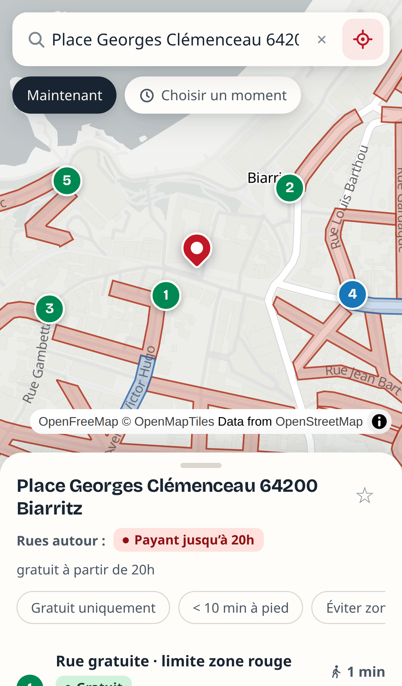

# FreePark BAB

Le « Waze du stationnement gratuit » pour Biarritz, Anglet et Bayonne.
Entrez une adresse (un resto à Biarritz, la plage à Anglet…) : l'app montre où commence
la zone gratuite la plus proche, où vous garer gratuitement **au moment où vous y allez**,
et le temps de marche.

PWA mobile-first : ouvrez-la dans Safari sur iPhone → Partager → « Sur l'écran d'accueil ».



## Ce que fait l'app

- **Recherche d'adresse** avec autocomplétion (API Adresse de l'État) + bouton « ma position ».
- **Sélecteur de moment** : « maintenant » ou une date/heure (« samedi 20h »).
- **Carte** : zones payantes *actives au moment choisi* en rouge, zones bleues en bleu,
  parkings gratuits (OpenStreetMap) en vert. Une zone payante 9h-19h apparaît gratuite à
  20h — avec l'avertissement « payant demain à 9h » pour éviter le piège du lendemain.
- **Suggestions classées** par temps de marche : parkings gratuits, rues en limite de zone
  payante, zones bleues (disque). Tap → itinéraire piéton Apple Plans / Google Maps.
- **Filtres** : gratuit uniquement, < 10 min à pied, éviter les zones bleues. **Favoris**
  en local.
- Quand la rue est gratuite au moment choisi : encart « Garez-vous sur place ».

## Démarrer

```bash
npm install
npm run data   # (re)génère public/data/zones.geojson depuis les open data
npm run dev
```

## Données

`scripts/build-data.mjs` agrège et normalise :

| Source | Contenu |
|---|---|
| data.biarritz.fr | zones payantes (rouge/orange/verte/jaune) + zones bleues |
| anglet-opendatapaysbasque.opendatasoft.com | stationnement payant du littoral |
| bayonne.fr (data.gouv.fr) | zones payantes des 5 quartiers |
| OpenStreetMap (Overpass) | parkings publics gratuits (`amenity=parking` + `fee=no`) |

Les **horaires** ne sont pas dans les open data : ils sont encodés à la main dans
`scripts/schedules.config.mjs` depuis les sites officiels (saisonnalité Biarritz,
mai→octobre à Anglet, lun-ven 9h-18h / sam 9h-14h à Bayonne…). C'est le fichier à mettre
à jour si une commune change ses règles.

⚠️ Les données peuvent être incomplètes ou datées : **vérifiez toujours la signalisation
sur place.**

## Stack

Vite + React + TypeScript · MapLibre GL (tuiles OpenFreeMap) · Turf.js · vite-plugin-pwa.
Zéro backend : données embarquées au build, géocodage et tuiles en direct.

```bash
npm test           # moteur horaires + suggestions (vitest)
npm run build      # tsc + vite build (PWA)
node scripts/e2e-drive.mjs   # parcours complet Playwright (serveur dev requis)
```
